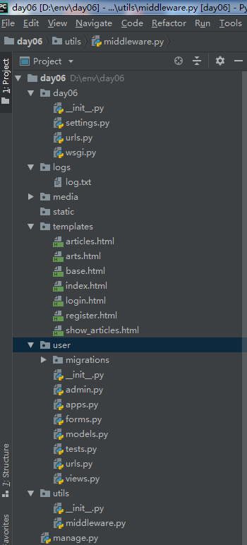

# Django图片上传与下载，分页，日志功能实现

## 文件目录结构展示



## 一.Django图片的上传与下载实现

### 在app文件夹中的models.py中创建模型
```
from django.db import models


# 在数据库中只保存图片的路径，图片的文件实际保存在app包文件夹中的media媒体文件夹中
# Create your models here.
class Article(models.Model):
    title = models.CharField(max_length=20)
    desc = models.CharField(max_length=150)
    img = models.ImageField(upload_to='article')
    create_time = models.DateTimeField(auto_now_add=True)

    class Meta:
        db_table = 'article'
```
### 在app文件夹中的views.py中编写功能代码
```
# 上传本地电脑图片到服务器
def add_article(request):
    if request.method == 'GET':
        return render(request, 'articles.html')

    if request.method == 'POST':
        # 获取数据
        img = request.FILES.get('img')
        title = request.POST.get('title')
        desc = request.POST.get('desc')
        # 创建图片文章
        Article.objects.create(img=img, title=title, desc=desc)

        return HttpResponse('创建图片成功')

# 在网页中显示图片
def show_article(request, id):
    if request.method == 'GET':
	# 获取一张图片
        article = Article.objects.get(pk=id)

        return render(request, 'show_articles.html', {'article': article})
```
### 在工程文件夹中的templates文件中创建articles.html，show_articles.html
```
# 上传图片页面



    上传图片




    # enctype 属性规定在发送到服务器之前应该如何对表单数据进行编码,该属性值表示不对字符编码，在使用包含文件上传控件的表单时，必须使用该值
    <form action="" method="post" enctype="multipart/form-data">
        标题：<input type="text" name="title">
        描述：<input type="text" name="desc">
        图片：<input type="file" name="img">
        <input type="submit" value="上传图片">
    </form>

```
```
# 显示图片页面



    图片展示




    标题：{{ article.title }}<br>
    图片：<br>
    描述：{{ article.desc }}<br>

```
### 在setting中设置静态文件访问media媒体文件夹

```
# 配置媒体文件路径
MEDIA_URL = '/media/'
MEDIA_ROOT = os.path.join(BASE_DIR, 'media')
```
### 在工程包中urls.py中设置media媒体文件夹访问路径

```
urlpatterns += static(MEDIA_URL, document_root=MEDIA_ROOT)
```
### 在app文件夹中urls.py中添加访问路由
```
urlpatterns = [
    url(r'^add_article/', views.add_article, name='add_article'),
    url(r'^show_article/(\d+)', views.show_article, name='show_article'),
]
```

## 二.分页功能实现
### app文件夹中views.py代码
```
# 分页
def articles(request):
    if request.method == 'GET':
        # 默认拿第一页
        page = request.GET.get('page', 1)
        # 查询到所有的文章信息
        articles = Article.objects.all()
        # 执行分页显示操作,将所有文章进行分页每一页10条数据
        paginator = Paginator(articles,10)
        # 获取第一页的文章信息
        arts = paginator.page(page)


        return render(request, 'arts.html', {'arts': arts})
```

### 模板中添加articles.html
```



    图片展示




    
    标题：{{ art.title }}<br>
    图片：
    描述：{{ art.desc }}<br>
    
    <p>
	# 页数显示arts.paginator.page_range方法显示文章的页数
	# 如果有上页拿到上页	
        
	# 点击跳转到上页
            <a href="?page={{arts.previous_page_number}}">上一页</a>
        
	# 页数显示arts.paginator.page_range方法显示文章的页数
        
            <a href="?page={{i}}">{{i}}</a>
        
	# 如果有拿到下一页
        
	# 点击跳转到下一页
            <a href="?page={{arts.next_page_number}}">下一页</a>
        

    </p>



```
### app中urls配置
```
urlpatterns = [
    url(r'^articles/', views.articles, name='articles'),
]
```

## 三.日志文件配置
### 在middleware 中设置中间件获取访问与响应的日志
```
# 日志文件的中间件
class LoggingMiddleware(MiddlewareMixin):
    def process_request(self, request):
        # 记录当前请求访问服务器的时间，请求的参数，及内容等
        request.init_time = time.time()
        request.init_body = request.body
        return None

    def process_response(self, request, response):
        try:
            # 记录返回响应的时间和访问服务器的时间差，及返回的状态码
            times = time.time() - request.init_time
            # 响应状态码
            code = response.status_code
            # 响应内容
            res_body = response.content
            # 请求内容
            req_body = request.init_body

            # 日志信息
            msg = '%s %s %s %s' % (times, code, res_body, req_body)
            # 写入日志
            logging.info(msg)
        except Exception as e:
            logging.critical('log error, Exception: %s' % e)
            
        return response
```

###  setting中的日志配置
```
LOGGING = {
    # 必须是 1
    'version': 1,
    # 禁用日志，false表示不禁用
    'disable_existing_loggers': False,
    # 指定写入到日志文件夹中的日志格式
    'formatters': {
        'default': {
            'format': '%(name)s %(asctime)s %(message)s'
        }
    },
    'handlers': {
        'console': {
	    # 接收错误等级
            'level': 'INFO',
	    # 保存路径
            'filename': '%s/log.txt' % os.path.join(BASE_DIR, 'logs'),
            'formatter': 'default',
            # 日志文件大于5M自动备份
            'class': 'logging.handlers.RotatingFileHandler',
            'maxBytes': 5 * 1024 * 1024,
        }
    },
    'loggers': {
        '': {
            'handlers': ['console'],
            'level': 'INFO',
        }
    },
}
```

